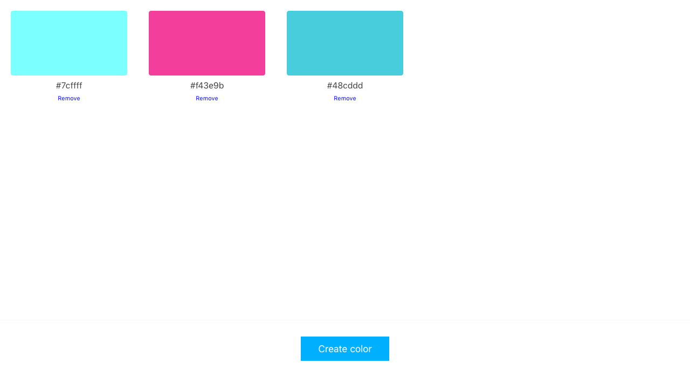
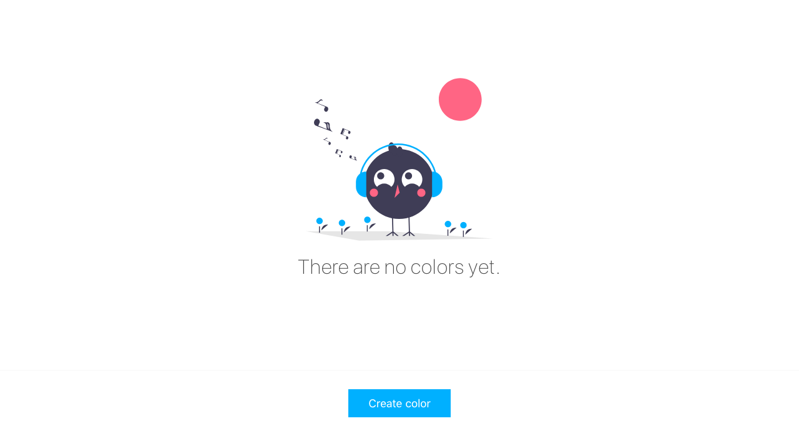

# Color generator

Let's create a page that allows us to generate random colors.

1. When the user adds colors, they are added to the beggining of the list, so the last color added is always visible:

2. User should be able to remove a color by clicking on the remove button under each color:

3. Once a new color is added, it appears again in the front:

4. When there are no colors display a message:

> use CRA ([create react app](https://create-react-app.dev/)) to bootstrap your project

> How to generate a HEX color - Each color channel can be between 0 and 255, you can use `Math.random` and then `toString(16)`. Make sure the result for each channel (R,G and B) has 2 digits so we end up with 6 digit HEX color. Feel free to explore other ways to create HEX colors.
